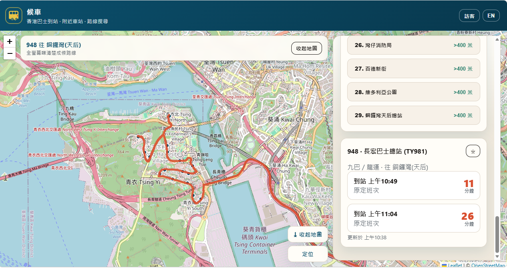

# 候車 (HKbus)

A lightweight Hong Kong bus arrivals map — nearby stops, route search, and a large road-following map so people can **see the whole bus route clearly**.

**Live demo:** [https://bus-hk.vercel.app/](https://bus-hk.vercel.app/)



## Why this exists

Official apps and open data are powerful, but the route map is often hard to read on a small strip or buried behind lists. This project aims to make the **bus map the main surface**:

- Expanded map by default
- Road-following polylines for selected routes
- Nearby stops + live ETAs in a side panel
- Simple enough that anyone can fork, improve, and ship

Contributions that make the map clearer, faster, or more complete are especially welcome.

## Features

- **Nearby stops** — geolocation, stop cards, ETAs for KMB / LWB and Citybus
- **Route search** — look up routes such as `948`, `49M`, `A31`, `1`, `104`
- **Large map view** — full-size map on load; collapse when you want more list space
- **Road-aligned routes** — waypoints + OSRM-assisted paths where available
- **Favorites** — saved stops on this device (optional account / Firebase sync)
- **Bilingual UI** — 繁體中文 / English
- **Static frontend** — no build step required for local use

## Suggested license: MIT

This repository is released under the **[MIT License](LICENSE)**.

MIT is a good fit here because it is:

- Short and easy for contributors to understand
- Permissive — people can fork, improve the map UX, and reuse the code
- Compatible with most open-source tooling and hosting (Vercel, GitHub Pages, etc.)

You keep copyright; others may use, modify, and redistribute with attribution. See `LICENSE` for the full text.

> **Note on data:** Government open data and map tiles have their own terms. The MIT license covers **this project’s code and docs**, not third-party APIs, tiles, or waypoint datasets.

## Quick start

```bash
git clone https://github.com/Charleschtsoi/HKbus.git
cd HKbus
```

Serve the folder with any static file server (required so `fetch` works for local JSON):

```bash
# Python
python3 -m http.server 8080

# or Node
npx --yes serve -l 8080
```

Open [http://localhost:8080](http://localhost:8080). Allow location when prompted for Nearby.

Optional cloud sync for favorites:

```bash
cp config.example.js config.js
# edit config.js → set auth.cloudSync = true and Firebase web config
```

## Project structure

| Path | Role |
|------|------|
| `index.html` | Page shell, map container, panels |
| `app.js` | Nearby search, routes, ETAs, map drawing |
| `account.js` | Optional guest / account favorites |
| `styles.css` | Layout, expanded map, side panel |
| `config.js` / `config.example.js` | Optional Firebase sync config |
| `ctb-stops.json` | Citybus stop index used for nearby ETAs |
| `gtfs-map.json` | Route id map for waypoint files |
| `docs/preview.png` | README preview screenshot |

## Data sources & credits

Arrival and stop data come from Hong Kong government open transport APIs (updated roughly every minute):

- [KMB / LWB ETA API](https://data.etabus.gov.hk/)
- [Citybus ETA API](https://data.gov.hk/)

Map rendering uses [Leaflet](https://leafletjs.com/) and [OpenStreetMap](https://www.openstreetmap.org/copyright) tiles. Route geometry may use community [route waypoints](https://github.com/hkbus/route-waypoints) and OSRM for road following.

This is **not** an official app of any bus company.

## Contributing

Ideas that help people “see the bus map” more easily:

1. Clearer route polylines / stop markers / labels on the map
2. Better mobile layout while keeping a large map
3. More operators or richer GTFS alignment
4. Accessibility (keyboard, screen readers, contrast)
5. Performance (stop cache, ETA batching, tile loading)
6. Docs, translations, and setup polish

### Suggested workflow

1. Fork the repo and create a branch: `cursor/your-change-3b92` or any descriptive name
2. Keep changes focused; prefer small PRs
3. Test Nearby + Search on desktop and a phone-sized viewport
4. Open a pull request describing the UX improvement

No formal CLA — by contributing you agree your changes are under the same MIT license.

## Disclaimer

ETAs and stop data can be delayed, incomplete, or wrong. Always check the road and official sources when it matters. Use at your own risk.

## Links

- Repository: [github.com/Charleschtsoi/HKbus](https://github.com/Charleschtsoi/HKbus)
- Live site: [bus-hk.vercel.app](https://bus-hk.vercel.app/)
- License: [MIT](LICENSE)
